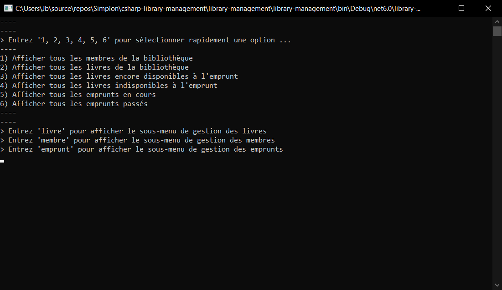

# Exercice Console C# .NET 6.0
### Contexte du projet
La bibliothèque municipale souhaite vérifier les entrées/sorties des livres qu'elle a en sa possession et ainsi pouvoir consulter son stock à un instant donné.
* Le code devra être développé en mode console dans un langage 100% orienté objet (Java ou C#)
* Le code devra respecter les formalismes vus en cours
* Un menu pour la saisie pourra être réalisé :
	* Ajout / modification d'un livre
	* Ajout / modification d'un emprunteur
	* Consultation du stock à un instant donné
	* Consultation des emprunts en cours et passés d'un emprunteur 
* Les données seront stockées dans un fichier csv à la fermeture du programme et rechargées à l'ouverture
----------
# Rendu

  
Console

  

  
Diagramme de classe

  

- [x] Interface en ligne de commande (Menu)
- [x] Afficher la liste des membres de la bibliothèque et leurs informations
- [x] Afficher la liste des livres de la bibliothèque et leurs informations
- [x] Afficher les livres disponibles à l'emprunt
- [x] Afficher les livres indisponibles à l'emprunt
- [x] Afficher les emprunts en cours
- [x] Afficher les emprunts passés
- [x] Gestion des membres :
	- Chargement et sauvegarde des données depuis un fichier "members.csv"
	- Création de nouveau membre
	- Supprimer un membre
	- Modifier les informations d'un membre
	- Afficher les détails d'un membre nom, prénom, date d'inscription, son nombre d'emprunt, les emprunts en cours avec leurs dates et le nombre de jours passés
- [x] Gestion des livres :
	- Chargement et sauvegarde des données depuis un fichier "books.csv"
	- Création de nouveau livre
	- Supprimer un livre
	- Modifier les informations d'un livre
	- Afficher les détails d'un livre titre, auteur, genre, collection, année de publication, nombre en stock, disponible ou non à l'emprunt, son nombre d'emprunt totale, les emprunts en cours avec les informations concernant l'emprunt (par qui, date d'emprunt, combien de jours)
- [x] Gestion des emprunts des membres :
	- Chargement et sauvegarde des données depuis un fichier "borrowingRecords.csv"
	- Emprunter un livre
	- Retourner un livre
# Structure du fichier members.csv
| Id | Nom | Prénom | Date d'Inscription |
| -------- | -------- | -------- | -------- |
| 1 | Rhum | Florence | 12/03/2023 15:22
| 2 | Reunion | Aurore | 15/03/2023 10:30
| 3 | Delegue | Coraline | 10/03/2023 09:00
# Structure du fichier books.csv
| Id | Titre | Auteur | Genre | Collection | Année de publication | Stock | Stock Maximum |
| -------- | -------- | -------- | -------- | -------- | -------- | -------- | -------- |
| 1 | Livre de SF | Luc Jedi | Science-Fiction | SF-Collection | 2022 | 3 | 5
| 2 | Apprendre l'Anglais | Elisabeth Duck | Éducation | Apprendre | 2019 | 0 | 10
| 3 | Apprendre l'Espagnol | Alberto Toto | Éducation | Apprendre | 2016 | 1 | 7
| 4 | Apprendre le Chinois | Tag Tong | Éducation | Apprendre | 2021 | 8 | 8
# Structure du fichier borrowingRecords.csv
| Id | Livre Id | Membre Id | Date d'Emprunt | Date de Retour |
| -------- | -------- | -------- | -------- | -------- |
| 1 | 1 | 1 | 12/03/2023 09:23 | null
| 2 | 1 | 2 | 17/03/2023 15:24 | null
| 3 | 1 | 3 | 13/03/2023 11:12 | null
| 4 | 3 | 2 | 16/03/2023 12:45 | 18/03/2023 17:08
| 5 | 2 | 3 | 18/03/2023 20:24 | null
